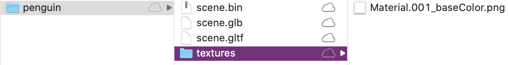

# Epic 1

With epic 1 we created a web app with the ability to recognize "barcode markers". When the camera on the phone or laptop recognizes the marker, the app enhances the camera stream with AR functionality: showing text over the marker, showing a 3d box over the marker, showing a custom 3d model over the marker, playing a sound, or drawing lines between markers.

With the functionality we implemented we were able to create a proof of concept web AR app. At this stage the user has to print out the given barcode markers and put them on the object of interest.

See [this video](https://drive.google.com/file/d/1teWcL39Us8xr9aYBNlM7stuhZb1C4WGH/view?usp=sharing) for a demonstration.

## Experience made during epic 1

The group had different levels of experience with web development, Javascript, Docker and everything else we needed to use for making a web AR app. The first days were therefore spent getting to know the basics of the technologies.

During epic 1 we started getting to know the AR libraries three.js, A-frame, and AR.js. We spent a lot of time trying to understand how they work and how they interact with each other.

Already in the very beginning we encountered compatibility issues with laptops and phones that seemed to not be AR compatible, but these problems were solved (see [Notes](notes.md)) or simply ignored, as it is possible to use a lot of the AR technology even if the phone does not officially support it.

## Pros and cons with the approach

Pro: Enhancing physical models with points of interest works well with AR and marker recognition. So far we have simply enhanced the real world with static information, but it seems that it would also work well to enhance it with interactive elements (like control panels for a physical submarine :)).

Con: One of the mains goals with this epic is to make AR more available for Equinor employees. We encountered compability issues with our laptops and phones, which means that others will probably encounter the same issues - meaning that our web app might not be easily accessible for everyone.

## More detailed notes

### AR Compatability
Need ARCore for A-frame to work.
    * List of smartphones with ARCore: https://developers.google.com/ar/discover/supported-devices

When we had a supported device, this is what worked:
* Android + Chrome browser (v.83 +)
    * Need to enable the webXR flags in chrome://flags
* iPhone
    * Need to install the app "XR Viewer" from appstore

### Using devices without AR support

Android devices without support for ARCore doesn't show the AR button in the browser,
or if they do, the AR button will not work properly.

It is possible to force show the AR button in Chrome by setting some flags in `chrome://flags`.
The flags we've enabled are the following:
* WebXR Incubations
* Experimental Web Platform features (search for "web platform")
* Enable Portals. (search for "web platform")
* Web Platform Controls updated IU (search for "web platform")

It seems that at least some AR functionality can still be accessed even though the device does not have full AR support.
So far we have been able to use the following functionalities on phones without AR support:

* Camera (Moto G5)

### Tracking symbols
AR.js comes with two tracking functionalities: Image Tracking and Marker Tracking. Images are like photos (very detailed), while markers are very simple symbols. After some testing and reading, it seems that using markers is better for tracking in terms of speed and stability.

Links:
* https://ar-js-org.github.io/AR.js-Docs/

### A note about QR-codes
QR-codes are symbols that are too complex to use as markers. The tracking is not good and you need to be very close to the qr-code in order to track it as a symbol. Therefore we are not using QR-codes as markers.

### Barcodes
Barcodes are simple symbols with good performance. Barcodes are generated symbols for a number. You don't need a symbol/pattern file, it is enough to just specify the number used for generating the barcode. For example, using 3x3 matrix code type, we have 64 standardized symbols available between 0-63. Then it is enough to specify the number in the html code.

Links:
* How to use: https://aframe.io/blog/arjs/#different-type-of-markers-pattern-and-barcode
* Info: https://github.com/artoolkitx/artoolkitx/wiki/Creating-and-using-square-barcode-markers
* Generator: https://au.gmented.com/app/marker/marker.php

### Trouble recognizing barcode ~~with laptop~~ with black background
With [Commit #26](https://github.com/equinor/eit-web-ar/commit/3c82867d0a231d38d44d794825fe564e65f36a39) we're able to show text when the app recognizes barcode `0`.

~~All of us were able to recognize the barcode with our phones, but none of us were able to recognize the barcode using the webcam on our laptops.~~

All of us were able to recognize the barcode with our phones. We also were able to recognize the barcode using the webcam on our laptops,
but only when the barcode marker had a white background - not a black one.

### Marker confidence
We've experienced some problems with markers being detected when they shouldn't be detected.
We looked into setting some minimum detection confidence level to ensure that the detected markers were "real".

It seems that there is a `minConfidence` property on the three.js object that deals with marker recognition.
There is also a `min-confidence` attribute to the `a-marker` in AR.js, although not documented and not fully implemented.
It seems simple enough to finish the implementation of this (see line 5090 in aframe-ar.js).

Even with the `min-confidence` things implemented, a confidence check can't be (easily) implemented at this time.
The reason is that the barcode marker check in three.js seems to be binary (true/false).
When three.js recognizes a barcode marker, it simply tells us that it has found the marker with confidence 1.
A `min-confidence` property won't make much sense as long as three.js can't give us their confidence.

### 3D models
In this project we have chosen to use gltf models (.gltf files) to complement the AR application with CGI/3D models. There are a lot of already made models on the web free to download, and the ones we have used are found at https://sketchfab.com. The most common structural convention is to save every gltf model in separate folders with a unique name, and the content inside as three files with the names and filetypes scene.gltf, scene.bin and textures (folder), where the textures folder holds some graphical features used in the model. It is recommended that the binary version of the gltf model is used, .glb, to avoid problems with loading textures in Safari related to CORS and/or reverse proxy and/or cookie. So in the project we are using glb files in the implementation.

To convert from gltf to glb the program glTF Pipeline can be used. It can be installed using the terminal command `npm install -g gltf-pipeline`, presupposing that Node.js is already installed. Then the file is converted by running the command `gltf-pipeline -i scene.gltf -o scene.glb` in the same directory as the gltf file is located. Now the path structure will look something like this:


Format: 

Assuming that a-frame has already been installed, the gtlf/glb model can easily be loaded and used like this:

```html
<a-asset-item id="penguin" src="./gltf/penguin/scene.glb" preload="auto"></a-asset-item>
<a-entity gltf-model="#penguin"></a-entity>
```

We added barcodes to 3D models and placed them in the AR application to investigate if it is possible to trigger events by interacting with them. This appears to be too intricate for us to solve, but it should be possible. The main challange is that the technology we are now using is based on what the camera is observing. The camera will not "see" the 3D models, they are placed on screen. So a possible solution could be to track the screen instead of (or in addition to) the camera. Then the code would have event listeners monitoring the screen instead of camera input.